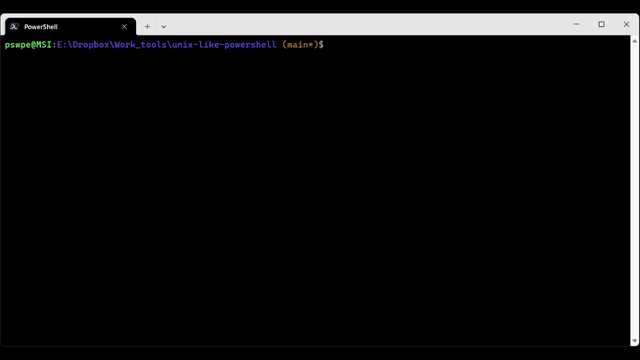

# unix-like-powershell





A lightweight **PowerShell 7.5** profile for Windows that makes the terminal feel more “Ubuntu-ish” / bash-like: familiar helper commands (`head`, `tail`, `grep`, `rm -rf`, `export`, `which`, `cd -`), quieter PSReadLine behavior, and a Git-aware prompt.

> Note: This repo packages a PowerShell **profile script** (not a module). You install it by copying it into your `$PROFILE`.

---

## Disclaimer

This profile was created and tested by **Shaowu Pan**, with assistance from **ChatGPT (GPT-5.2)**.

---

## What I already have installed (Ubuntu-ish tools)

- `vim`
- `wget2`

On Windows, the closest “apt install” equivalent is **winget**:  
https://github.com/microsoft/winget-cli

---

## Installation

### 1) Create your profile file (if it doesn’t exist)
```powershell
if (!(Test-Path -LiteralPath $PROFILE)) {
  New-Item -ItemType File -Path $PROFILE -Force | Out-Null
}
```

### 2) Find the profile path
```powershell
$PROFILE
```

Example (Windows):  
`C:\Users\pswpe\Documents\PowerShell\Microsoft.PowerShell_profile.ps1`

### 3) Copy the profile script into your `$PROFILE`
Open your profile:
```powershell
vim $PROFILE
```

Then copy/paste the contents of this repo’s `Microsoft.PowerShell_profile.ps1` into it and save.

### 4) Reload (or restart) your terminal
Reload without restarting:
```powershell
. $PROFILE
```

More details on profiles:  
https://learn.microsoft.com/en-us/powershell/module/microsoft.powershell.core/about/about_profiles?view=powershell-7.5

---

## Features

### PSReadLine (quiet + bash-like)
- Disables prediction UI while typing (no noisy history list)
- `Ctrl+r` reverse history search
- Up/Down arrow prefix history search
- Tab menu completion
- Common shortcuts:
  - `Ctrl+a` / `Ctrl+e` — begin/end of line
  - `Ctrl+k` / `Ctrl+u` — kill line / backward kill line
  - `Ctrl+l` — clear screen
  - `Ctrl+d` — delete char / exit

### Linux-ish command wrappers
- `which` — show resolved command paths
- `export NAME=value` — set environment variables
- `source file.ps1` — dot-source scripts
- `touch` — create/update files
- `head -n N file`
- `tail -n N file`, `tail -f file`
- `less file` — page output
- `man cmd` — PowerShell help in a pager
- `grep` — uses `rg` if installed; otherwise falls back to `Select-String`
  - supports: `-i`, `-n`, `-r`, `-v`
- `rm` — Linux-ish argument parsing
  - supports: `rm -rf`, `rm -r -f`, `rm -- -weirdname`, `rm -n` (dry run), `rm -v`

### Navigation + prompt
- `cd -` returns to the previous directory
- `..`, `...`, `....` quick jumps
- Prompt shows: `user@host:path (branch*)$` with ANSI colors
  - `*` indicates a dirty Git repo

---

## Requirements

- **PowerShell 7.x** (`pwsh`)
- Works best in **Windows Terminal**, but not required

Optional (recommended):
- `git` (branch display in prompt)
- `rg` (ripgrep) for faster `grep`
- `bat` for nicer `cat` (if you choose to extend)
- `eza` for a nicer `ls` (if you choose to extend)

---

## Important: alias overrides

PowerShell ships `ls` and `rm` as aliases (e.g., `ls -> Get-ChildItem`, `rm -> Remove-Item`).  
This profile removes those aliases so the Linux-ish functions can take over.

Verify you are using functions:
```powershell
Get-Command ls, rm
```
Expected: `CommandType` should be `Function`.

---

## Usage examples

### rm
```powershell
rm -rf build
rm -r -f build
rm -- -weirdname
rm -n -rv .\somefolder   # dry-run + verbose
```

### grep
```powershell
grep -n "TODO" -r .
grep -i "error" logfile.txt
grep -v "DEBUG" logfile.txt
```

### head / tail
```powershell
head -n 5 file.txt
tail -n 20 file.txt
tail -f file.txt
```

### cd -
```powershell
cd C:\Windows
cd -
```

---

## Smoke test

Copy/paste this after installing:

```powershell
. $PROFILE

# Confirm key functions are active
Get-Command ls, rm, head, tail, grep, which, export, touch

# Create a sandbox
mkdir _unixlike_test -Force | Out-Null
1..50 | Set-Content .\_unixlike_test\numbers.txt

# head/tail
head -n 5 .\_unixlike_test\numbers.txt
tail -n 5 .\_unixlike_test\numbers.txt

# grep
grep 7 .\_unixlike_test\numbers.txt
grep -n 7 .\_unixlike_test\numbers.txt
grep -v 7 .\_unixlike_test\numbers.txt

# rm -rf
rm -n -rv .\_unixlike_test
rm -rf .\_unixlike_test
Test-Path .\_unixlike_test
```

Expected:
- `Get-Command ls, rm` returns `Function`
- `head`/`tail` print correct lines
- `grep` finds matches
- `rm -rf` deletes the test directory
- final `Test-Path` prints `False`

---

## License

MIT
